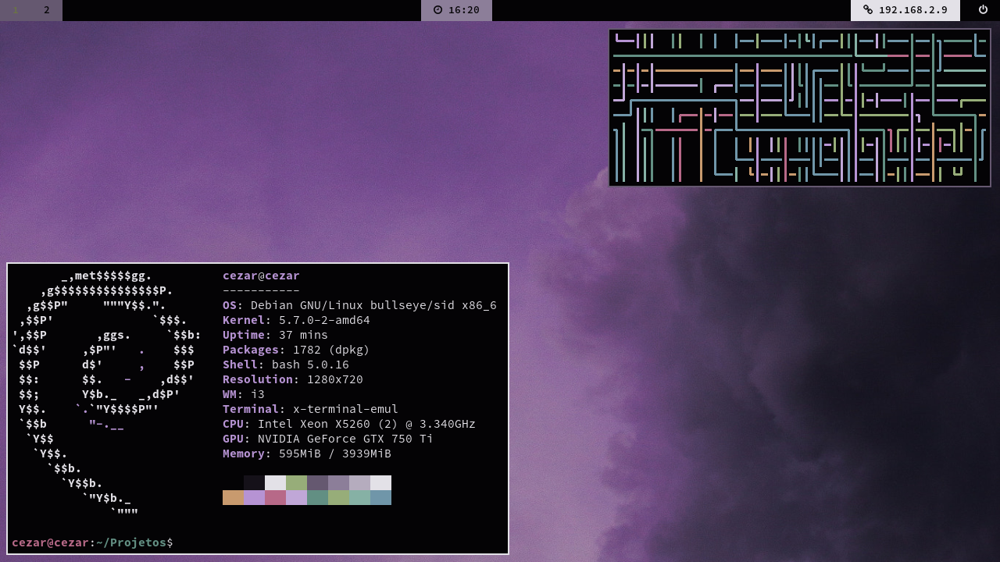

<h2>Available Themes</h2>
<ul>

<h1>000</h1>

by Unix121
<h1>001</h1>

by Unix121
<h1>002</h1>

by Unix121
<h1>003</h1>

by Unix121
<h1>004</h1>

by Unix121
<h1>005</h1>

by Unix121
<h1>006</h1>

by Unix121
<h1>007</h1>

by Unix121
<h1>008</h1>

by Unix121
<h1>009</h1>

by Unix121
<h1>010</h1>

by Unix121
<h1>011</h1>

by Unix121
<h1>012</h1>

by Unix121
<h1>013</h1>

by Unix121
</ul>
<h1>014</h1>

by cizordj
</ul>
